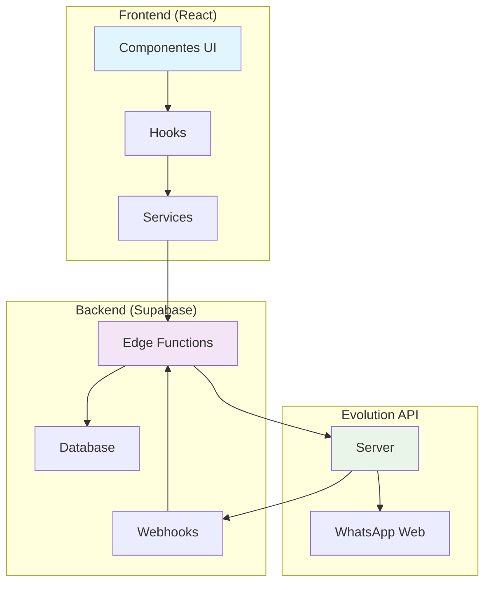
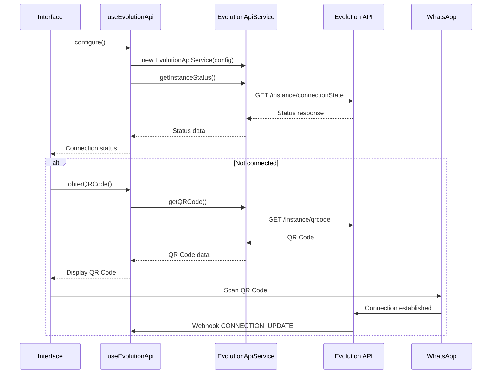
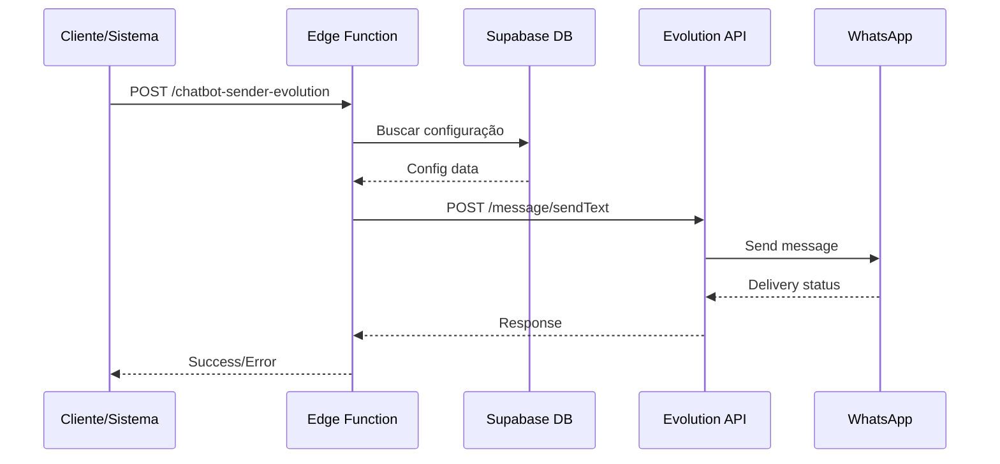
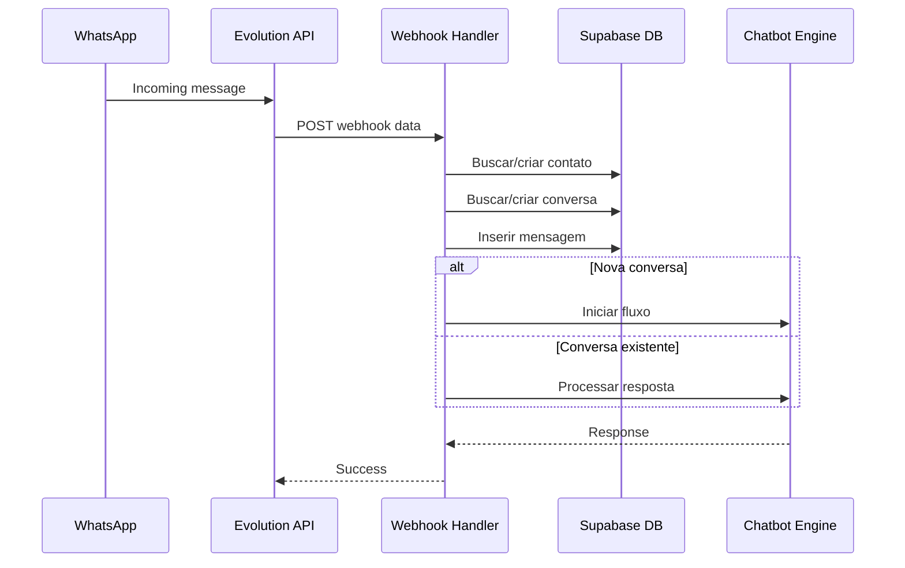

# Documentação Completa - Integração Evolution API

## Índice
1. [Visão Geral](#visão-geral)
2. [Arquitetura](#arquitetura)
3. [Configuração](#configuração)
4. [Estrutura do Banco de Dados](#estrutura-do-banco-de-dados)
5. [Fluxo de Comunicação](#fluxo-de-comunicação)
6. [Componentes e Hooks](#componentes-e-hooks)
7. [Edge Functions](#edge-functions)
8. [Tipos TypeScript](#tipos-typescript)
9. [Webhooks](#webhooks)
10. [Envio de Mensagens](#envio-de-mensagens)
11. [Tratamento de Erros](#tratamento-de-erros)
12. [Segurança](#segurança)
13. [Monitoramento](#monitoramento)

## Visão Geral

A integração Evolution API permite que o sistema se conecte ao WhatsApp Business para envio e recebimento de mensagens. A Evolution API é uma solução open-source que atua como intermediário entre nossa aplicação e o WhatsApp Web.

### Funcionalidades Suportadas
- ✅ Mensagens de texto
- ✅ Mensagens com mídia (imagem, documento, áudio, vídeo)
- ✅ Mensagens com botões interativos
- ✅ Mensagens com listas
- ✅ Webhooks para recebimento de mensagens
- ✅ Status de conexão em tempo real
- ✅ QR Code para autenticação
- ✅ Múltiplas instâncias por empresa

## Arquitetura



## Configuração

### 1. Configuração da Evolution API

A configuração é gerenciada pela tabela `evolution_api_config`:

```sql
CREATE TABLE evolution_api_config (
  id UUID PRIMARY KEY DEFAULT gen_random_uuid(),
  empresa_id UUID NOT NULL REFERENCES empresas(id),
  api_key TEXT NOT NULL,
  server_url TEXT NOT NULL,
  instance_name TEXT NOT NULL,
  webhook_url TEXT,
  webhook_events TEXT[] DEFAULT ARRAY['MESSAGES_UPSERT', 'CONNECTION_UPDATE', 'QRCODE_UPDATED'],
  ativo BOOLEAN DEFAULT true,
  created_at TIMESTAMP WITH TIME ZONE DEFAULT now(),
  updated_at TIMESTAMP WITH TIME ZONE DEFAULT now()
);
```

### 2. Configuração de Webhooks

Os webhooks são configurados automaticamente com os seguintes eventos:
- `MESSAGES_UPSERT`: Mensagens recebidas/enviadas
- `CONNECTION_UPDATE`: Mudanças no status da conexão
- `QRCODE_UPDATED`: Atualizações do QR Code

## Estrutura do Banco de Dados

### Tabelas Relacionadas

1. **evolution_api_config**: Configurações da API
2. **whatsapp_connections**: Status das conexões (legacy)
3. **mensagens**: Armazenamento de mensagens
4. **conversas**: Conversas do WhatsApp
5. **contatos**: Contatos sincronizados

### Políticas RLS

```sql
-- Usuários só podem acessar configs da própria empresa
CREATE POLICY "Users can manage their company evolution api config"
ON evolution_api_config FOR ALL
USING (empresa_id = (SELECT profiles.empresa_id FROM profiles WHERE profiles.id = auth.uid()));

-- Super admins têm acesso total
CREATE POLICY "Super admins can manage all evolution api configs"
ON evolution_api_config FOR ALL
USING (is_super_admin());
```

## Fluxo de Comunicação

### 1. Inicialização da Conexão



### 2. Envio de Mensagens



### 3. Recebimento de Mensagens



## Componentes e Hooks

### useEvolutionApi Hook

Localização: `src/hooks/useEvolutionApi.ts`

```typescript
interface UseEvolutionApiReturn {
  evolutionApi: EvolutionApiService | null;
  status: EvolutionApiStatus;
  isConfigured: boolean;
  config: EvolutionApiConfig | null;
  loading: boolean;
  conectando: boolean;
  
  // Métodos de configuração
  configure: (config: EvolutionApiConfig) => void;
  
  // Métodos de envio
  sendMessage: (phone: string, message: string) => Promise<boolean>;
  sendTextMessage: (phone: string, message: string) => Promise<boolean>;
  sendMediaMessage: (phone: string, mediaUrl: string, mediaType: string, caption?: string, fileName?: string) => Promise<boolean>;
  sendButtonMessage: (phone: string, text: string, buttons: Array<{ id: string; text: string }>, footer?: string) => Promise<boolean>;
  sendListMessage: (phone: string, title: string, description: string, buttonText: string, sections: Array<{title: string; rows: Array<{ id: string; title: string; description?: string }>}>, footerText?: string) => Promise<boolean>;
  sendImageMessage: (phone: string, imageUrl: string, caption?: string) => Promise<boolean>;
  sendDocumentMessage: (phone: string, documentUrl: string, fileName: string) => Promise<boolean>;
  sendAudioMessage: (phone: string, audioUrl: string) => Promise<boolean>;
  sendVideoMessage: (phone: string, videoUrl: string, caption?: string) => Promise<boolean>;
  
  // Métodos de controle
  checkStatus: () => Promise<void>;
  verificarStatus: () => Promise<any>;
  getQRCode: () => Promise<string | null>;
  obterQRCode: () => Promise<any>;
  createInstance: () => Promise<boolean>;
  connectInstance: () => Promise<boolean>;
  restartInstance: () => Promise<boolean>;
  logoutInstance: () => Promise<boolean>;
  setWebhook: (webhookUrl: string, events?: string[]) => Promise<boolean>;
  configurarWebhook: () => Promise<boolean>;
  disconnect: () => void;
}
```

### EvolutionApiService

Localização: `src/services/evolution-api.ts`

Classe principal para comunicação com a Evolution API:

```typescript
class EvolutionApiService {
  private config: EvolutionApiConfig;
  private baseUrl: string;

  constructor(config: EvolutionApiConfig);
  
  // Métodos de instância
  createInstance(): Promise<EvolutionApiResponse>;
  connectInstance(): Promise<EvolutionApiResponse>;
  getInstanceStatus(): Promise<EvolutionApiResponse>;
  getQRCode(): Promise<EvolutionApiResponse>;
  restartInstance(): Promise<EvolutionApiResponse>;
  logoutInstance(): Promise<EvolutionApiResponse>;
  
  // Métodos de envio
  sendTextMessage(phone: string, text: string, options?: { delay?: number; linkPreview?: boolean }): Promise<EvolutionApiResponse>;
  sendButtonMessage(phone: string, text: string, buttons: Array<{ id: string; text: string }>, footer?: string): Promise<EvolutionApiResponse>;
  sendListMessage(phone: string, title: string, description: string, buttonText: string, sections: Array<{title: string; rows: Array<{ id: string; title: string; description?: string }>}>, footerText?: string): Promise<EvolutionApiResponse>;
  sendImageMessage(phone: string, imageUrl: string, caption?: string): Promise<EvolutionApiResponse>;
  sendDocumentMessage(phone: string, documentUrl: string, fileName: string): Promise<EvolutionApiResponse>;
  sendAudioMessage(phone: string, audioUrl: string): Promise<EvolutionApiResponse>;
  sendVideoMessage(phone: string, videoUrl: string, caption?: string): Promise<EvolutionApiResponse>;
  
  // Configuração
  setWebhook(webhookUrl: string, events?: string[]): Promise<EvolutionApiResponse>;
  
  // Processamento
  processWebhookMessage(webhookData: EvolutionApiWebhookMessage): ProcessedMessage;
}
```

### Componentes UI

#### EvolutionApiConfigTab

Localização: `src/components/admin/EvolutionApiConfigTab.tsx`

Interface administrativa para gerenciar configurações Evolution API:

- Listar configurações existentes
- Criar novas configurações
- Editar configurações existentes
- Ativar/desativar configurações
- Excluir configurações

#### WhatsAppConnectionsReal

Localização: `src/components/whatsapp/WhatsAppConnectionsReal.tsx`

Interface para usuários finais gerenciarem conexões:

- Visualizar status da conexão
- Obter QR Code para conectar
- Verificar status da instância
- Configurar webhooks

## Edge Functions

### 1. whatsapp-webhook-evolution

Localização: `supabase/functions/whatsapp-webhook-evolution/index.ts`

Processa webhooks recebidos da Evolution API:

```typescript
interface EvolutionApiWebhookData {
  event: string;
  instance: string;
  data: {
    key: {
      remoteJid: string;
      fromMe: boolean;
      id: string;
    };
    pushName?: string;
    message?: {
      conversation?: string;
      extendedTextMessage?: { text: string };
      imageMessage?: { url: string; mimetype: string; caption?: string };
      documentMessage?: { url: string; mimetype: string; title: string; fileName: string };
      audioMessage?: { url: string; mimetype: string };
      videoMessage?: { url: string; mimetype: string; caption?: string };
      buttonsResponseMessage?: { selectedButtonId: string; selectedDisplayText: string };
      listResponseMessage?: { singleSelectReply: { selectedRowId: string } };
    };
    messageTimestamp: number;
    status?: string;
  };
}
```

**Fluxo de processamento:**

1. Recebe webhook da Evolution API
2. Filtra apenas mensagens recebidas (não enviadas)
3. Extrai conteúdo da mensagem baseado no tipo
4. Busca ou cria contato no banco
5. Busca ou cria conversa ativa
6. Insere mensagem no banco
7. Aciona chatbot se necessário

### 2. chatbot-sender-evolution

Localização: `supabase/functions/chatbot-sender-evolution/index.ts`

Envia mensagens através da Evolution API:

```typescript
interface SendMessageRequest {
  telefone: string;
  mensagem: string;
  tipo?: 'texto' | 'imagem' | 'documento' | 'audio' | 'video' | 'botoes' | 'lista';
  opcoes?: {
    imageUrl?: string;
    caption?: string;
    documentUrl?: string;
    fileName?: string;
    audioUrl?: string;
    videoUrl?: string;
    botoes?: Array<{ id: string; text: string }>;
    footer?: string;
    lista?: {
      title: string;
      description: string;
      buttonText: string;
      sections: Array<{
        title: string;
        rows: Array<{ id: string; title: string; description?: string }>;
      }>;
      footerText?: string;
    };
  };
  empresaId?: string;
  instanceName?: string;
}
```

**Endpoints Evolution API utilizados:**

- `/message/sendText/{instance}` - Mensagens de texto
- `/message/sendMedia/{instance}` - Mídia (imagem, documento, áudio, vídeo)
- `/message/sendButtons/{instance}` - Mensagens com botões
- `/message/sendList/{instance}` - Mensagens com listas

## Tipos TypeScript

Localização: `src/types/evolution-api.ts`

### Interfaces Principais

```typescript
export interface EvolutionApiConfig {
  apiKey: string;
  serverUrl: string;
  instanceName: string;
  webhookUrl?: string;
  webhookEvents?: string[];
}

export interface EvolutionApiStatus {
  connected: boolean;
  instanceStatus: string;
  lastCheck: Date | null;
}

export interface ProcessedMessage {
  id: string;
  phone: string;
  fromMe: boolean;
  timestamp: Date;
  senderName: string;
  senderPhoto?: string;
  type: 'text' | 'image' | 'document' | 'audio' | 'video' | 'contact' | 'location' | 'button_response' | 'list_response';
  content: string;
  attachment?: {
    type: 'image' | 'document' | 'audio' | 'video';
    url: string;
    fileName?: string;
    mimeType?: string;
  };
  buttonResponse?: {
    selectedButtonId: string;
    selectedDisplayText: string;
  };
  listResponse?: {
    selectedRowId: string;
  };
}
```

## Webhooks

### Configuração de Webhooks

Os webhooks são configurados automaticamente quando uma configuração Evolution API é ativa:

```typescript
const webhookConfig = {
  url: config.webhookUrl,
  webhook_by_events: false,
  webhook_base64: false,
  events: ['MESSAGES_UPSERT', 'CONNECTION_UPDATE', 'QRCODE_UPDATED']
};
```

### URL do Webhook

O webhook deve apontar para:
```
https://[seu-projeto].supabase.co/functions/v1/whatsapp-webhook-evolution
```

### Eventos Suportados

1. **MESSAGES_UPSERT**: Mensagens recebidas ou enviadas
2. **CONNECTION_UPDATE**: Mudanças no status da conexão
3. **QRCODE_UPDATED**: Atualizações do QR Code

### Processamento de Mensagens

O webhook processa diferentes tipos de mensagem:

```typescript
// Texto simples
if (data.message?.conversation) {
  conteudoMensagem = data.message.conversation;
  tipoMensagem = 'texto';
}

// Texto estendido
else if (data.message?.extendedTextMessage) {
  conteudoMensagem = data.message.extendedTextMessage.text;
  tipoMensagem = 'texto';
}

// Imagem
else if (data.message?.imageMessage) {
  tipoMensagem = 'imagem';
  conteudoMensagem = data.message.imageMessage.caption || '';
  metadata.mediaUrl = data.message.imageMessage.url;
  metadata.mimeType = data.message.imageMessage.mimetype;
}

// Resposta de botão
else if (data.message?.buttonsResponseMessage) {
  tipoMensagem = 'botao_resposta';
  conteudoMensagem = data.message.buttonsResponseMessage.selectedDisplayText;
  metadata.selectedButtonId = data.message.buttonsResponseMessage.selectedButtonId;
}

// Resposta de lista
else if (data.message?.listResponseMessage) {
  tipoMensagem = 'lista_resposta';
  conteudoMensagem = data.message.listResponseMessage.singleSelectReply.selectedRowId;
  metadata.selectedRowId = data.message.listResponseMessage.singleSelectReply.selectedRowId;
}
```

## Envio de Mensagens

### 1. Mensagens de Texto

```typescript
const payload = {
  number: telefoneFormatado,
  text: mensagem,
  delay: 0,
  linkPreview: true
};
```

### 2. Mensagens com Mídia

```typescript
// Imagem
const payload = {
  number: telefoneFormatado,
  mediatype: 'image',
  media: imageUrl,
  caption: caption
};

// Documento
const payload = {
  number: telefoneFormatado,
  mediatype: 'document',
  media: documentUrl,
  fileName: fileName
};
```

### 3. Mensagens Interativas

```typescript
// Botões
const payload = {
  number: telefoneFormatado,
  buttonMessage: {
    text: mensagem,
    buttons: [
      { id: 'btn1', text: 'Opção 1' },
      { id: 'btn2', text: 'Opção 2' }
    ],
    footer: 'Escolha uma opção'
  }
};

// Lista
const payload = {
  number: telefoneFormatado,
  listMessage: {
    title: 'Título da Lista',
    description: 'Descrição',
    buttonText: 'Ver Opções',
    sections: [{
      title: 'Seção 1',
      rows: [
        { id: 'opt1', title: 'Opção 1', description: 'Descrição da opção 1' },
        { id: 'opt2', title: 'Opção 2', description: 'Descrição da opção 2' }
      ]
    }],
    footerText: 'Rodapé opcional'
  }
};
```

## Tratamento de Erros

### 1. Erros de Conexão

```typescript
try {
  const response = await evolutionApi.getInstanceStatus();
  setStatus({
    connected: response.data?.instance?.state === 'open',
    instanceStatus: response.data?.instance?.state || 'unknown',
    lastCheck: new Date(),
  });
} catch (error) {
  console.error('Erro ao verificar status Evolution API:', error);
  setStatus(prev => ({
    ...prev,
    connected: false,
    instanceStatus: 'error',
    lastCheck: new Date(),
  }));
}
```

### 2. Erros de Envio

```typescript
try {
  const response = await evolutionApi.sendTextMessage(phone, message);
  return !!(response.success || response.key);
} catch (error) {
  console.error('Erro ao enviar mensagem:', error);
  toast({
    title: "Erro ao enviar mensagem",
    description: "Não foi possível enviar a mensagem via Evolution API",
    variant: "destructive",
  });
  return false;
}
```

### 3. Erros de Configuração

```typescript
if (!evolutionApi) {
  toast({
    title: "Evolution API não configurada",
    description: "Configure a integração Evolution API primeiro",
    variant: "destructive",
  });
  return false;
}
```

## Segurança

### 1. Autenticação API

A Evolution API usa um sistema de API Key:

```typescript
const headers = {
  'Content-Type': 'application/json',
  'apikey': config.apiKey,
};
```

### 2. Row Level Security (RLS)

Todas as configurações são protegidas por RLS:

```sql
-- Usuários só acessam configs da própria empresa
CREATE POLICY "Users can manage their company evolution api config"
ON evolution_api_config FOR ALL
USING (empresa_id = (SELECT profiles.empresa_id FROM profiles WHERE profiles.id = auth.uid()));
```

### 3. Validação de Webhooks

Os webhooks são validados para garantir que vêm da Evolution API:

```typescript
// Filtrar apenas mensagens recebidas
if (payload.event !== 'MESSAGES_UPSERT' || payload.data.key.fromMe) {
  return new Response(JSON.stringify({ success: true, message: 'Evento ignorado' }), {
    status: 200,
  });
}
```

### 4. Sanitização de Dados

Números de telefone são sanitizados:

```typescript
const telefoneFormatado = telefone.replace(/\D/g, ''); // Remove formatação
```

## Monitoramento

### 1. Logs de Sistema

Todos os eventos são registrados:

```typescript
console.log('Configurando Evolution API:', config);
console.log('Webhook Evolution API recebido:', JSON.stringify(payload, null, 2));
console.log('Enviando mensagem Evolution API:', { telefone, mensagem, tipo });
```

### 2. Status da Conexão

O status é verificado periodicamente:

```typescript
const checkStatus = useCallback(async () => {
  if (!evolutionApi) return;
  await checkStatusInternal(evolutionApi);
}, [evolutionApi]);
```

### 3. Métricas de Performance

- Tempo de resposta da API
- Taxa de sucesso de envio
- Status de conexão por instância
- Volume de mensagens processadas

### 4. Alertas e Notificações

O sistema notifica sobre:
- Falhas de conexão
- Erros de envio
- Webhooks não processados
- Configurações inválidas

## Considerações de Performance

### 1. Rate Limiting

A Evolution API tem limites de taxa que devem ser respeitados:
- Máximo de mensagens por minuto
- Delays entre envios para evitar bloqueios

### 2. Cache de Configurações

As configurações são carregadas uma vez e mantidas em cache:

```typescript
const loadConfig = useCallback(async () => {
  // ... buscar configuração do banco
  if (data) {
    setConfig(evolutionConfig);
    configure(evolutionConfig);
  }
}, []);
```

### 3. Processamento Assíncrono

Webhooks são processados de forma assíncrona para não bloquear:

```typescript
// Processar chatbot em background
try {
  const chatbotResponse = await fetch(`${supabaseUrl}/functions/v1/chatbot-engine`, {
    method: 'POST',
    headers: {
      'Content-Type': 'application/json',
      'Authorization': `Bearer ${supabaseServiceKey}`
    },
    body: JSON.stringify({
      conversaId: conversa!.id,
      iniciarFluxo: true
    })
  });
} catch (chatbotError) {
  console.error('Erro ao iniciar chatbot:', chatbotError);
}
```

## Troubleshooting

### Problemas Comuns

1. **QR Code não aparece**
   - Verificar se a instância foi criada
   - Confirmar se a API Key está correta
   - Verificar logs da Evolution API

2. **Mensagens não são recebidas**
   - Verificar configuração do webhook
   - Confirmar se os eventos estão configurados
   - Verificar logs da edge function

3. **Envio de mensagens falha**
   - Verificar status da conexão
   - Confirmar formato do número de telefone
   - Verificar se há rate limiting

4. **Conexão fica desconectada**
   - Verificar estabilidade da Evolution API
   - Confirmar configurações de rede
   - Verificar se o WhatsApp Web está ativo

### Comandos de Diagnóstico

```sql
-- Verificar configurações ativas
SELECT * FROM evolution_api_config WHERE ativo = true;

-- Verificar últimas mensagens
SELECT * FROM mensagens 
WHERE created_at > NOW() - INTERVAL '1 hour' 
ORDER BY created_at DESC;

-- Verificar status das conversas
SELECT status, COUNT(*) 
FROM conversas 
GROUP BY status;
```

---

Esta documentação cobre todos os aspectos da integração Evolution API no sistema. Para dúvidas específicas ou problemas não cobertos aqui, consulte os logs do sistema ou entre em contato com o suporte técnico.